<div align="center">



[](https://github.com/sahan2323)

</div>


<div align="center">



</div>


## About

I like building things end-to-end. An interface isn't a product until it's talking to a real backend and a real database, so that's usually where my attention goes — full-stack business applications, admin dashboards, booking and payment flows, and the API work that ties a few systems together into something that actually functions.

A lot of this runs through **oneCoreLab**, where I design and build commercial websites and internal tools — some of that work is below.

I'd rather have a small stack I actually reach for than a long list of things I've only opened the docs for once. What's below is what I build with.

<div align="center">



</div>


## Currently Building

| # | Focus |
|:-:|---|
| `01` | Full-stack business applications |
| `02` | SaaS-style platforms |
| `03` | Booking & payment systems |
| `04` | Admin dashboards & internal tools |
| `05` | Interactive web experiences |


## Tech Stack

<div align="center">



[](https://skillicons.dev)

</div>

| Category | Stack |
|---|---|
| **Frontend** | React · Next.js · TypeScript · JavaScript · HTML5 · CSS3 · Tailwind CSS · Vite · EJS |
| **Backend** | Node.js · Express.js · REST APIs · Authentication & Authorization · Session Management |
| **Database** | PostgreSQL · MongoDB · Oracle · SQL · PL/SQL · Sequelize · Mongoose |
| **Tools & Platforms** | Git · GitHub · Postman · Vercel · npm · VS Code |
| **Integrations** | Stripe · Third-Party APIs · QR Code Systems |
| **Interactive / Motion** | GSAP · Spline |


## Engineering Approach

```text
Idea → Requirements → Architecture → UI/UX → Implementation → Testing → Deployment → Iteration
```

What I optimize for, in order: **maintainable code, clean architecture, good database design, sensible API structure, performance, security, and a UI that doesn't get in the way.** I'm not running enterprise-scale systems — I'm building applications that need to hold up in production and stay easy to extend, and that's the bar I hold my own work to.


## Featured Projects

### `Maple Ceylon Media`

> A media platform for Toronto's Sri Lankan-Canadian community, built from scratch with a cinematic hero carousel and live YouTube, Google Maps, and TikTok integration throughout.

`React` `Vite` `Tailwind CSS` `Framer Motion` `React Router`

**Focus:** Frontend Architecture · Third-Party API Integration · Responsive Design · Animation

**Live:** [maple-ceylon.com](https://maple-ceylon.com) · **Repository:** `[add repo link]`

---

### `Jayaka Ceylon Cinnamon`

> A premium redesign for a Ceylon cinnamon export brand — a scroll-driven canvas frame sequence and crossfade transformation showcases, built around a dark luxury design system.

`React` `Vite` `Framer Motion`

**Focus:** Scroll-Driven Animation · Visual Storytelling · Component Architecture

**Live:** [jayaka-cinnamon-web.vercel.app](https://jayaka-cinnamon-web.vercel.app) · **Repository:** `[add repo link]`

---

### `oneCoreLab`

> The agency platform I run client work through — rebuilt from a legacy Express/EJS/MongoDB stack into a React + Vite frontend backed by an Express + Prisma API, including a full client portal with authentication and task management.

`React` `Vite` `Node.js` `Express` `Prisma` `SQLite`

**Focus:** Full-Stack Migration · Authentication · Client Portal · API Design

**Live:** [onecorelab.com](https://onecorelab.com) · **Repository:** `[add repo link]`

---

### `Project Name`

> Short explanation of what the application does and the problem it solves.

`Tech` `Tech` `Tech`

**Focus:** Authentication · APIs · Database · Dashboard

**Repository:** `[add repo link]` · **Live Demo:** `[add live link]`


## GitHub Activity

<div align="center">


<br/>


</div>


## Development Journey

<div align="center">



</div>

I'm not claiming years of professional depth I don't have — I'm building real applications, running into real problems, and getting better at solving them each time.


## Current Focus

- Deeper system architecture and application structure
- Backend development at a more advanced level
- Database design and query performance
- API design patterns
- Application security fundamentals
- Modern React / Next.js patterns
- Building applications that scale sensibly


## Let's Build Something

If you're working on a product, platform, startup, or technical idea, let's talk.

<div align="center">

[](https://www.linkedin.com/in/sahan-vimukthi-hewa-gallage-bb3a24239/)
[](mailto:vimusahan23@gmail.com)
[](https://github.com/sahan2323)

</div>


